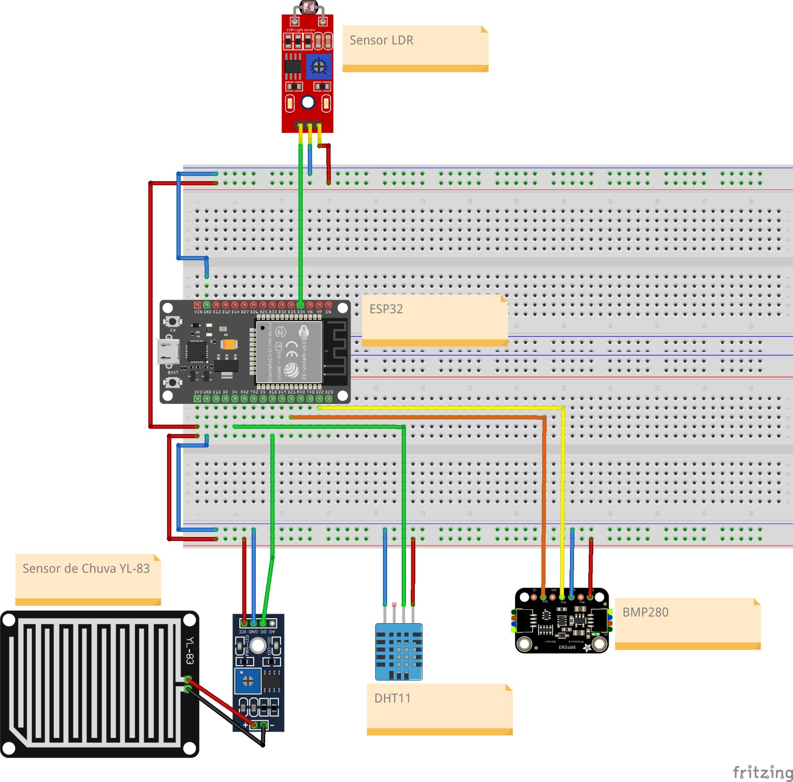

# TRABALHO FINAL FSE

## Integrantes

| Nome                                           | Matrícula |
| ---------------------------------------------- | --------- |
| [Laís Soares](https://github.com/Laisczt)      | 211029512 |
| [Bruna Lima](https://github.com/libruna)       | 211041105 |
| [José Augusto](https://github.com/JAugustoM)   | 231026429 |
| [Ana Catarina](https://github.com/an4catarina) | 211041099 |

## Sobre

Este repositório possui a implementação de uma estação meteorológica pessoal (PWS) com base na solução [Open Weather Station](https://github.com/panchazo/open-weather-station). A implementação foi adaptada de forma a utilizar uma ESP32 e no contexto da disciplina de Fundamentos de Sistemas Operacionais da UnB-FTCE.

PWS são estações de monitoramento meteorológico destinadas ao uso pessoal, com foco em acessibilidade (preço e usabilidade).

Estudo inicial: [Open Weather Station](https://github.com/Laisczt/FSE-OpenWeatherStation).

### Funcionalidades

* Sensores atmosféricos
  * Pressão atmosférica
  * Temperatura
  * Luminosidade
  * Humidade
  * Precipitação
* Comunicação sem-fio por WiFi
* Integração com a plataforma WUnderground
* Interface de visualização dos dados em tempo real (MQTT)

## Implementação

### Diferenças com relação a Open Weather Station

As principais diferenças da nossa implementação em relação a OWS (excluindo componentes específicos, arquitetura), são:

* Na OWS, o sistema Arduino se comunica através de Bluetooth com um dispositivo móvel, o qual envia os dados ao servidor através do WiFi ou, em especial, à rede móvel.
Como a nossa implementação não faz uso de rede móvel, dispensa também o uso de um dispositivo móvel e conexão Bluetooth, a própria ESP32 é usada para conexão WiFi
* Não possuimos sensores de velocidade e direção de vento/rajada de vento.

### Bill of Materials (BoM)

| Qtd   | Componente                  | Conexões no ESP32 (Pinos)                                                | Função / Descrição                                                                                                                               |
| :-----:| :----------------------------| :-------------------------------------------------------------------------| :-------------------------------------------------------------------------------------------------------------------------------------------------|
| **1** | **ESP32 DevKitC-1**         | -                                                                        | Microcontrolador principal responsável pela leitura dos sensores, conexão Wi-Fi, comunicação MQTT e integração com a API do Weather Underground. |
| **1** | **Módulo Sensor BMP280**    | **SDA:** GPIO 21 **SCL:** GPIO 22 **VCC:** 3.3V **GND:** GND    | Comunicação via I2C. Responsável pela leitura de Temperatura e Pressão Atmosférica.                                                              |
| **1** | **Módulo Sensor DHT11**     | **Data (OUT):** GPIO 4 **VCC:** 3.3V **GND:** GND                  | Protocolo proprietário (1-wire). Responsável pela leitura da Umidade Relativa do ar.                                                             |
| **1** | **Módulo Sensor LDR**       | **Sinal Analógico (AO):** GPIO 34 **VCC:** 3.3V **GND:** GND       | Leitura analógica. Usado para estimar a Radiação Solar / Luminosidade.                                                                           |
| **1** | **Módulo Sensor de Chuva YL-83**  | **Sinal Digital (DO):** GPIO 18 **VCC:** 3.3V (ou 5V) **GND:** GND | Leitura digital (0 ou 1). Placa de detecção de gotas + comparador LM393. Define se está chovendo ou não.                                         |
| **1** | **Protoboard (Breadboard)** | -                                                                        | Base para a montagem e distribuição de energia (3.3V e GND) para todos os módulos.                                                               |
| **1** | **Kit de Fios Jumpers**     | -                                                                        | Fios Macho-Macho e Macho-Fêmea para interligar os módulos à placa ESP32 e às trilhas de alimentação da protoboard.                               |

### Montagem

## Uso

[//]: # (Instruções de compilação, instalação, e uso)
[//]: # (Instruções para configuração de rede)